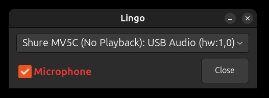

# Lingo GTK: Voice Typer - GTK4 Desktop App 🎤

[](voice_typer.py)
[](voice_typer.py)
[](voice_typer.py)
[](../whisper-model/whisper.cpp/)
[](../LICENSE.md)

A lightweight Linux desktop application that provides system-wide voice-to-text input. Speak naturally and your words appear wherever your cursor is focused - in any application!

*Warning: This application has only been tested on Ubuntu Linux.*



## How It Works

1. **Select Microphone** - select your device for your mic
2. **Click Microphone Checkbox** - when the checkbox is checked aything you speak will be typed into wherever your edit cursor is, in any application system wide.  
3. **Speak naturally** - after 1 second of silence, your speech is transcribed
4. **Text is typed** wherever your cursor is focused

## Whisper Setup (from project root)

You only need to run this once.

```bash
cd /path/to/lingo2
./setup-whisper.sh
```

## Running the GTK App

```bash
cd gtk-app
./setup.sh
./run.sh
```
The first run will create a virtual environment and install Python dependencies.

## Troubleshooting & Tips

Troubleshooting and notes are [here](TROUBLESHOOTING.md)


