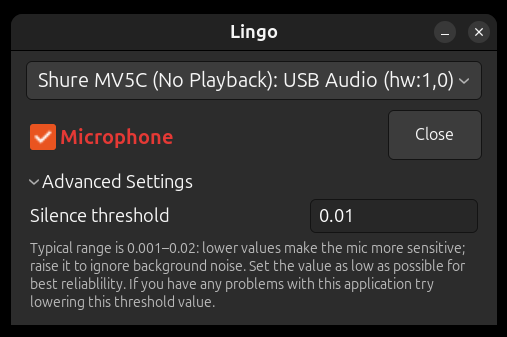

# Lingo Qt: Voice Typer - PyQt6 Desktop App 🎤

[](voice_typer/)
[](voice_typer/window.py)
[](voice_typer/)
[](../whisper-model/whisper.cpp/)
[](../LICENSE.md)

A lightweight Linux desktop application that provides system-wide voice-to-text input. Speak naturally and your words appear wherever your cursor is focused - in any application!

*Warning: This application has only been tested on Ubuntu Linux.*



## How It Works

1. **Select Microphone** - click the gear to open Settings and pick your mic
2. **Click Microphone Checkbox** - when the checkbox is checked anything you speak will be typed into wherever your edit cursor is, in any application system wide.
3. **Speak naturally** - after 1 second of silence, your speech is transcribed
4. **Text is typed** wherever your cursor is focused

The window background reports what the pipeline is doing, so you can dictate
without looking away from what you are typing into:

| Color | Meaning |
|-------|---------|
| default | idle, listening |
| 🟢 green | speech detected |
| 🟠 orange | transcribing with whisper |
| ⬜ white | typing the text out |

## Whisper Setup (from project root)

You only need to run this once.

```bash
cd /path/to/lingo2
./setup-whisper.sh
```

## Running

This project uses [uv](https://docs.astral.sh/uv/) for Python environment management.

### First-time setup

Install uv (if not already installed):

```bash
curl -LsSf https://astral.sh/uv/install.sh | sh
```

Then install the system dependencies (PortAudio, ffmpeg, and the X/xkb
libraries Qt's platform plugin needs) and the desktop entry:

```bash
cd qt-app
./setup.sh
```

Unlike the old GTK version there is no `--system-site-packages` venv to create:
PyQt6 comes from PyPI, whereas PyGObject had to come from the distro. `run.sh`
lets uv build and refresh the environment on every launch.

#### The `windowchrome` checkout

The colored title bar comes from
**[windowchrome](https://github.com/Clay-Ferguson/windowchrome)**, a small
reusable PyQt6 library kept in its own repository so several apps can wear the
same chrome. It is **not on PyPI**: `pyproject.toml` resolves it by path.

Note the path is `../../windowchrome` — **two** levels up, not one. This app
lives a directory deeper than the others that use it, so the checkout belongs
beside `lingo2`, not beside `qt-app`:

```bash
cd ../..                   # the directory holding lingo2/
git clone https://github.com/Clay-Ferguson/windowchrome.git
```

giving:

```
projects/
├── lingo2/
│   └── qt-app/            <- you are here
└── windowchrome/          <- must sit beside lingo2, not beside qt-app
```

If it is missing, `./run.sh` fails immediately with an unresolved path
dependency rather than with anything subtle. The checkout is used in place —
`uv` installs it editable, so there is nothing to build and an edit there is
live here on the next run.

### Running

```bash
./run.sh
```

…which is equivalent to:

```bash
uv run python -m voice_typer
```

### Adding dependencies

```bash
uv add <package>
```

This updates `pyproject.toml` and `uv.lock`.

## Code Layout

The Qt-free logic is deliberately kept separate from the GUI, so the parts
that are tied to Linux are also the parts that are easiest to test headlessly:

| Module | Responsibility | Qt? |
|--------|----------------|-----|
| `voice_typer/config.py` | YAML settings, audio-device enumeration | no |
| `voice_typer/transcribe.py` | resample, normalize, run `whisper-cli`, clean up output | no |
| `voice_typer/audio.py` | recording + RMS silence detection | signals only |
| `voice_typer/keyboard.py` | XDG Remote Desktop Portal keystroke injection (QtDBus) | D-Bus only |
| `voice_typer/window.py` | the control window | yes |
| `voice_typer/settings_dialog.py` | the settings dialog (widgets + validation only) | yes |
| `voice_typer/__main__.py` | dependency checks and startup | yes |

## Troubleshooting & Tips

Troubleshooting and notes are [here](TROUBLESHOOTING.md)
